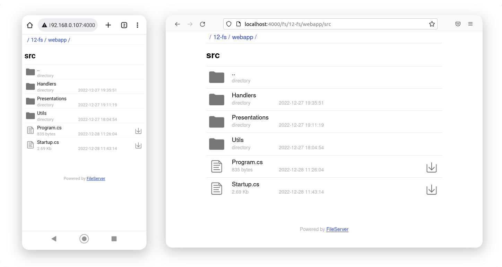
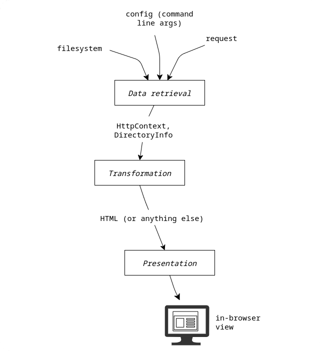

# File server

__Special thanks [@lriy816](https://github.com/lriy816) for finding a bug with non-ASCII characters!__

**Yet another version of file server by me**. 

**Note: this is more a file explorer / browser, than a static file server. If you need a static server for static website assets, i recommend using built-in static serving capabilities of your framework**. 

Last revision: 15 December 2024.

Old version with Vue 2 front-end is available on branch [v1](https://github.com/dmitriynaumov1024/fileserver-aspnetcore/tree/v1).

This variant of file server works without any front-end framework and is customizable (there are html building blocks, icons and a stylesheet in webapp/assets/).

Why this file server? Why once again? Because this one:

- has front-end without any single line of javascript, looks neat on both mobile and desktop:



- has much more understandable request pipeline:



- is easily customizable, even though it's pretty solid, you can adapt it for your needs.

## Prerequisites

- Any OS that supports .NET
- .NET SDK v6.0

## Usage

**Quick tryout**
```
cd webapp
dotnet run -- <root-directory> <port>
```

**Publish self-contained for Linux and run it**
```
dotnet publish --os linux --self-contained -p:PublishTrimmed=True -o ./dist
./dist/FileServer <root-directory> <port>
```

**Manual minification of self-contained**
```
# this can save up to 5 megabytes
rm ./dist/*Mvc*.dll
rm ./dist/*Razor*.dll
rm ./dist/*HttpSys*.dll
rm ./dist/*IIS*.dll
rm ./dist/*SignalR*.dll
```

## Web outline

- `/fs/{path}` - returs directory or file at given path relative to root-directory
- `/assets/{path}` - returns asset file from webapp/assets/
- `/download/{path}` - returns file at given path relative to root-directory as downloadable attachment 

## Copyright

- **.NET**: respecting original copyright, [more info here](https://dotnet.microsoft.com/)
- **File server**: MIT License  &copy; 2022 - 2024  Dmitriy Naumov  naumov1024@gmail.com

Last revision: 15 December 2024.
